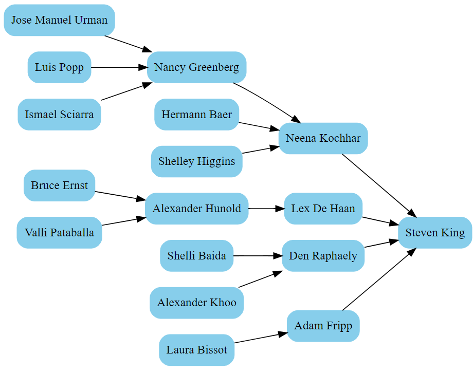

Hierarchy Viewer
================

Generates a hierarchy with GraphViz for any parent-child relationship hidden in a CSV tabular data file, with column names as header row. Also generates a HTML file with an animated D3 collapsible tree, for the parent-child relationship.

(1) Simplified Graphs
=====================

Run the following from the command line, to show the simple employee-manager dependency hierarchy, with employee ID as default object identifiers. Remark that the "from" column must be the unique identifier for each row. These are all the requiered command line arguments:

**<code>python viewer.py --f data/employees --from employee_id --to manager_id</code>**

IDs are unique, but not very friendly. If you have a column that can be used to easily identify an object, you can mention it. Here we have the same hierarchy, but we indetify the employees by their names:

**<code>python viewer.py --f data/employees --from employee_id --to manager_id --d employee_name</code>**

The **--rev** switch will change the direction of each arrow from parent to child (by default it is from child to parent). Here is the manager-employee hierarchy:

**<code>python viewer.py --f data/employees --from employee_id --to manager_id --d employee_name --rev</code>**

Each run will also create and show a HTML file with a D3 SVG graph as an animated collapsible tree, always for the same parent-child hierarchy (collapsed node appear with dark circles):

(2) Graphs with Groups
======================

Same as before, except we added the department ID to group all employees from each department in a surrounding "box":

**<code>python viewer.py --f data/employees --from employee_id --to manager_id --d employee_name --g department_id</code>**

In a similar manner we may group employees by job title:

**<code>python viewer.py --f data/employees --from employee_id --to manager_id --d employee_name --g job_id</code>**

(3) Detailed Graphs
===================

The **--all** flag will "expand" all other properties (except the display name) from the CSV file for each object. If you get an error that the URL is too long for the browser, copy and paste the generated DOT file content into the online GraphViz editor (but be aware that this may generate indeed a lot of data!).

**<code>python viewer.py --f data/employees --from employee_id --to manager_id --d employee_name --all</code>**

Here is a partial view of the generated graph:

The **data/employees.csv** test data file has been adapted [from here](https://gist.github.com/kevin336/acbb2271e66c10a5b73aacf82ca82784):

